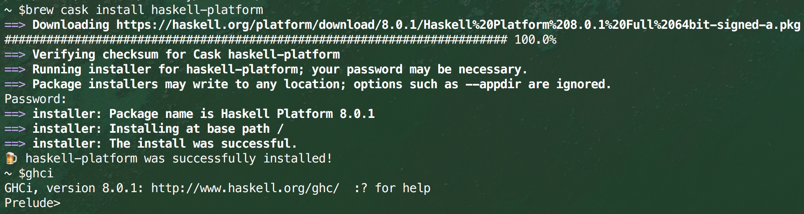

Glasgow Haskell Compiler

GHC is the leading implementation of Haskell, and comprises of a compiler and interpreter.

Download it from www.haskell.org/platform

`$ brew cask install haskell-platform`

`$ brew cask install caskroom/cask/brew-cask` // required if you get Error: Unknown command: cask
`$ ghci`
`Prelude>`

